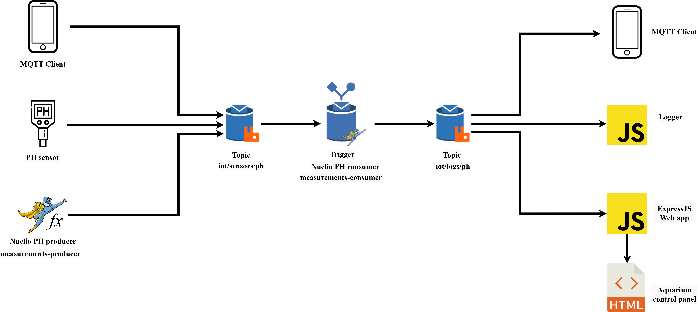

# SCIOT - Aquarium ph monitoring system

## Summary
[- Abstract](#Abstract): overview on the project's domain.\
[- Architecture](#Architecture): system architecture definition.\
[- Installation](#Installation): instructions to run the system from scratch.

## Abstract
This project was developed for the **"Serverless Computing for IoT"** course at the University of Salerno.
The goal was to simulate a system that continuously monitors the ph level of an aquarium in a serverless fashion.
Via a web app or a generic **MQTT** client, the user can access the logs of the measurements and based on these, can perform two actions:
	-   If the ph level is too high, the filters can be manually activated.
	-   Ordering a replacement for the filters.

The measurements produced by the system are currently generated randomly, since no actual IoT hardware was employed.

## Architecture
The ph measurements can be generated in three different ways:
- They could obviously be produced by an actual ph sensor.
- They can be manually generated from any MQTT client that publishes messages to the topic.
- They can be randomly generated from a function, in this case a Nuclio serverless function (**measurements-producer**).

As a baseline for the ph value, the number 6 was chosen; to this a random number is added. If the generated value is greater than 10, the user will be alerted in the web application.
At this point, a first **RabbitMQ** queue collects the measurements on the **'iot/sensors/ph'** topic.
Once a new measurement is received another Nuclio function, **measurements-consumer** is triggered. The value is processed and finally it is re-published on the **'iot/logs/ph'** topic.
This value can now be received by three different programs:
- Ant MQTT client subscribed to the logs topic.
- A simple logger implemented in Nodejs that just informs the user of the message by printing it into the console.
- An expressJS web app that informs the user of the dangerous ph level measurements and from where it is possible to take the aforementioned actions.

The following image highlights the final system architecture.
<p align="center">
    
</p>


## Installation
The system was developed on **Ubuntu, version 20.04**.
NodeJS is required to run the application.
Use the following commands in two shell windows to start up Nuclio and RabbitMQ instances using Docker:
- **Nuclio:**
    ```sh
    docker run -p 8070:8070 -v /var/run/docker.sock:/var/run/docker.sock -v /tmp:/tmp nuclio/dashboard:stable-amd64
    ```
- **RabbitMQ:**
    ```sh
    docker run -p 9000:15672  -p 1883:1883 -p 5672:5672  cyrilix/rabbitmq-mqtt
    ```
- **Deploy the functions on Nuclio**:
    - Open a browser window and go to **http://localhost:8070**.
    - Create a new prject named **sciot-water_ph_monitoring** (not sure if this is important or not).
    - Select **Create function** > **Import** > **Import**.
    - Navigate to the **'nuclio yaml functions'** folder and selects one yaml file. Repeat the process for the other function.
    - Change the IP addresses in the two imported functions, in the following locations:
        - In the source code of **measurements-producer**.
        - In the source code of **measurements-consumer**.
        - In the trigger for **measurements-consumer**.
    - Select **'Deploy'** in the top right for each function.
- **Install NodeJS dependencies**
    - The two required dependencies in NodeJS are **amqplib** and **express**, as specified in the **package.json** config file.   
    - In order to install them, from the project folder open a shell window and type 'npm i'.
- **Change IP addresses in the source code:**
    - In the **index.js** and **logger.js** files
- **Running the logger:**
    - In the console type **'node logger.js'** to run the logger
- **Running the web app:**
    - In the console type **'node index.js'** to start the express web server.
    - Go to **http://localhost:3000** to reach the aquarium control panel.
    - From here you can use the interface to display the measurements or execute the actions.

As specified above, now you should be able to send values via any MQTT client, or by shell commands such as **curl**.
